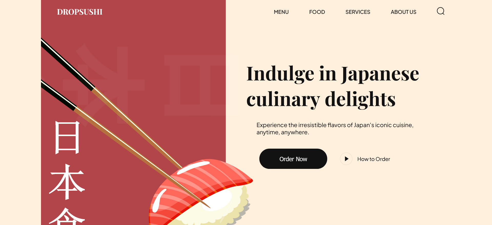

# Dropsushi 

This landing page serves as the online gateway for a Japanese food delivery service, providing customers with a convenient platform to explore and order a wide range of delicious Japanese dishes.

### Screenshot

### Link

- Live Site URL: [Netlify](https://dropsushi.netlify.app)

### Built with

- HTML
- CSS

### What I learned

This project provided me with valuable experience in handling complex webpage layouts, allowing me to enhance my skills in managing intricate design structures effectively.

### Continued development

The hamburger menu for mobile and tablet devices is not functional at the moment.

### Acknowledgements

[JavaScript Mastery](https://www.youtube.com/@javascriptmastery)
